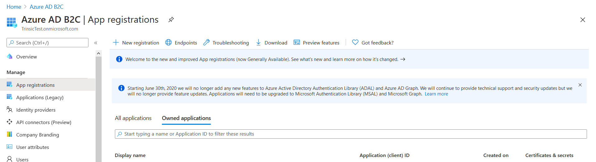
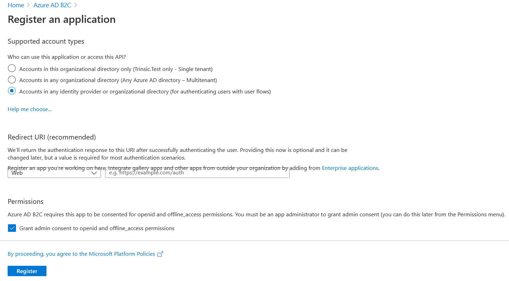

# Setting up Azure B2C

Here's some simple steps to create an Azure B2C organization for your application's login and sign up flows.

1. Open up your [Azure Portal](https://portal.azure.com) and sign in if you're not already logged in
2. Navigate to the Azure AD B2C resource
3. Click on `+ New Registration`

    - Give your application a name
    - Select the type for authenticating users with user flows
    - Add any redirect URI's that you would like
    - Check the box for granting admin concesnt to openid and offline_access permissions
    - Click on `Register`


**NOTE:** The **issuer** for the application is `<ApplicationName>.onmicrosoft.com` (example: `myapplication.onmicrosoft.com`). The B2C authority is `https://{ApplicationName}.b2clogin.com/tfp/{ApplicationName}.onmicrosoft.com/B2C_1_b2c_resown`

```
    "Issuer": "myapplication.onmicrosoft.com",
    "B2CAuthority": "https://myapplication.b2clogin.com/tfp/trinsictest.onmicrosoft.com/B2C_1_b2c_resown",
```

4. Get the **client secret** and the **client ID** for the application 
    * Click on your new Application and navigate on the side menu to **Certificates & secrets** which is located under Manage
    * Scroll down to Client secrets and click on `+ New client secret`
    * Record your secret and set them in the `DirectoryApplication` property in the configuration (either Azure, or the secrets file when testing locally). Example:
```
        "DirectoryApplication": {
            "ClientId": "2e4c1c2b-0cca-45f4-9a31-2c5255e0b211",
            "ClientSecret": "V_T-_01.95V6AyS_Lgxewu4HpK_~n~~t-3"
        },
```
5. Either create another application for sign in, or reuse the current one (note: reusing the same application is insecure).
6. Add a custom scope named `api.full` (full API access) to the application
    * Go to your application
    * Click on **Expose an API which is also found under the Manage side navigation
    * Click on `+ Add a scope` and give it the name `api.full`
7. Set the **client ID** and the **scope** of the application in the "SignInApplication" property in the configuration:
```
        "SignInApplication": {
            "ClientId": "2e4c1c2b-0cca-45f4-9a31-2c5255e0b211",
            "Scopes": [
                "https://TrinsicTest.onmicrosoft.com/2e4c1c2b-0cca-45f4-9a31-2c5255e0b211/api.full"
            ]
        },
```
Note that the scope contains the client ID of the application in the URL.
7. Set the **tenant ID** of the organization on which the applications were created in the `TenantId` property:
```
        "TenantId": "6c1ccfed-8a01-4285-adc5-f0a12a4fe96c"
```

### Sample secrets.json file
```
{
    "GraphServiceClientOptions": {
        "Issuer": "TrinsicTest.onmicrosoft.com",
        "B2CAuthority": "https://TrinsicTest.b2clogin.com/tfp/trinsictest.onmicrosoft.com/B2C_1_b2c_resown",
        "DirectoryApplication": {
            "ClientId": "2e4c1c2b-0cca-45f4-9a31-2c5255e0b211",
            "ClientSecret": "V_T-_01.95V6AyS_Lgxewu4HpK_~n~~t-3"
        },
        "SignInApplication": {
            "ClientId": "2e4c1c2b-0cca-45f4-9a31-2c5255e0b211",
            "Scopes": [
                "https://TrinsicTest.onmicrosoft.com/2e4c1c2b-0cca-45f4-9a31-2c5255e0b211/api.full"
            ]
        },
        "TenantId": "6c1ccfed-8a01-4285-adc5-f0a12a4fe96c"
    }
}
```

